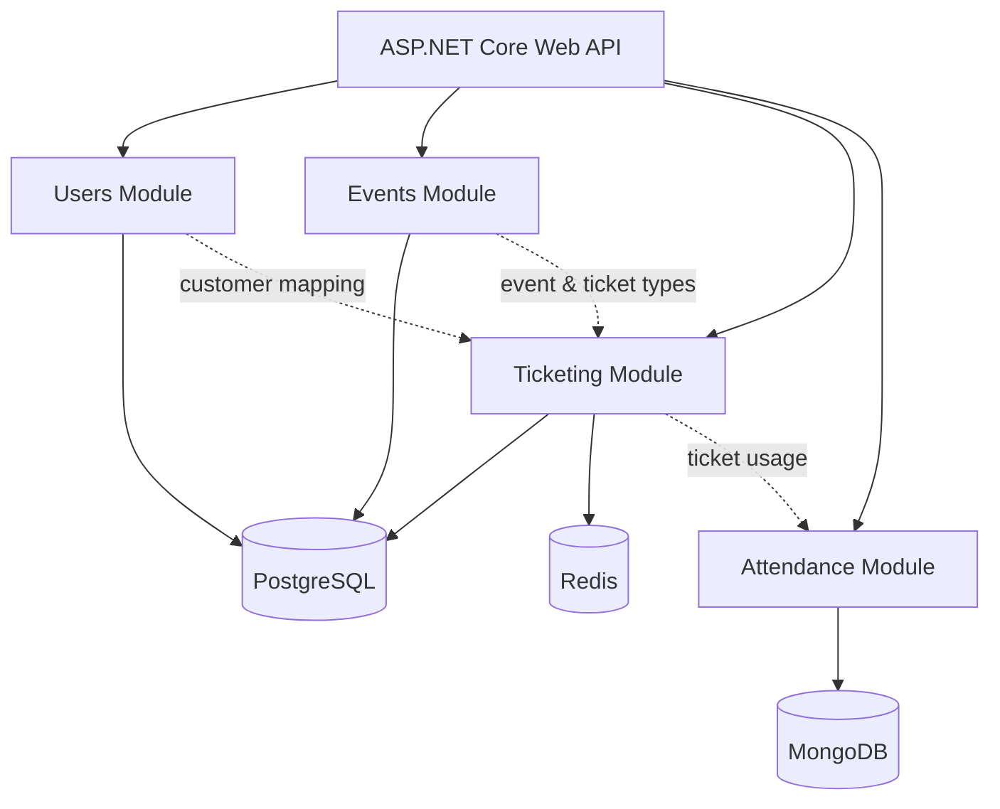
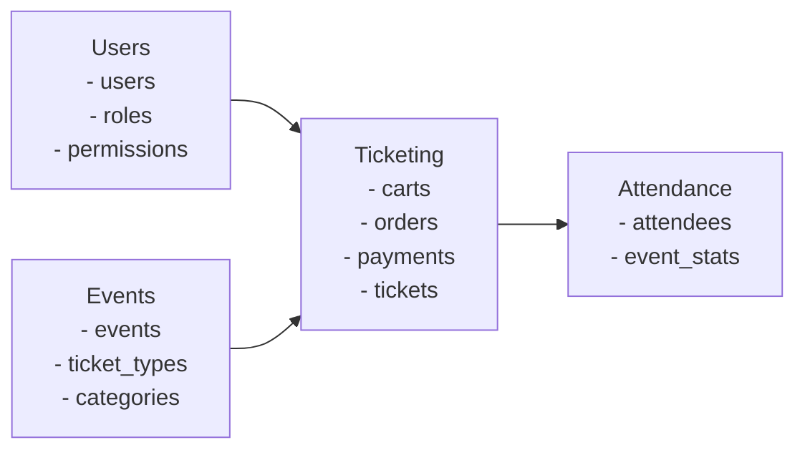

# Evently — Modular Monolith Event Management System

**Evently** is a fictional **ticketing and event management application** built as a learning project to demonstrate **Domain-Driven Design (DDD)**, **bounded contexts**, and **modular monolith architecture** using **ASP.NET Core Web API**.

The system supports managing events, selling tickets, processing payments, and tracking attendance for events such as concerts, conferences, and movie screenings.

---

## Architecture Overview

- **Architecture style**: Modular Monolith  
- **Single executable**: ASP.NET Core Web API  
- **Modules implemented as vertical slices**, later refactored toward **Clean Architecture**  
- Strong emphasis on:
  - Clear module boundaries
  - Ownership of data per module
  - Avoiding tight coupling between domains  

Although deployed as a single application, each module behaves like an isolated bounded context.

---

## High-Level System Diagram (Mermaid)



---

## Module & Schema Layout (GitHub-safe ASCII Diagram)

This diagram mirrors the whiteboard-style diagrams from the course and is guaranteed to render everywhere.

```
API REQUEST
     |
     v
+--------------------------------------------------+
|              ASP.NET Core Web API                |
|                                                  |
|  +---------+  +---------+  +-----------+  +-----------+
|  | Users   |  | Events  |  | Ticketing |  | Attendance|
|  +---------+  +---------+  +-----------+  +-----------+
|       |            |            |               |
+-------|------------|------------|---------------+
        v            v            v               v
+--------------------------------------------------+
|                     Database                     |
|                                                  |
|  users.*     events.*     ticketing.*     attendance.*
|  (Postgres)  (Postgres)   (Postgres)      (MongoDB)
|                               |
|                             Redis
+--------------------------------------------------+
```

---

## Bounded Context Responsibilities



---

## Technology Stack

- **Backend**: ASP.NET Core Web API  
- **Identity & Authentication**: Keycloak  
- **Primary Database**: PostgreSQL (schema-per-module)  
- **Caching / Fast access**: Redis (Ticketing module)  
- **Analytics / Attendance storage**: MongoDB (Attendance module)  

---

## Database Design

- A **single PostgreSQL database**
- Each module owns its **own schema**
- Modules **do not directly access** other modules’ schemas
- Cross-module communication is handled via controlled boundaries

---

## Core Modules

### Users Module
- Core entity: **User**
- Manages users, roles, and permissions
- Implements **RBAC**
- Source of truth for identity

### Events Module
- Defines events, ticket types, and categories
- Administrative module
- Source of truth for event data

### Ticketing Module (Core Domain)
- Largest and most complex module
- Handles carts, orders, payments, refunds, discounts, and ticket generation
- Uses Redis for performance-sensitive operations

### Attendance Module
- Tracks event attendance and ticket usage
- Detects anomalies (e.g. duplicate ticket usage)
- Uses MongoDB for analytics-style storage

---

## Key Design Principles

- Modular monolith with **clear bounded contexts**
- Vertical slice architecture
- Progressive refactoring toward **Clean Architecture**
- Separation of administrative and customer-facing concerns
- Focused on real-world architectural trade-offs
