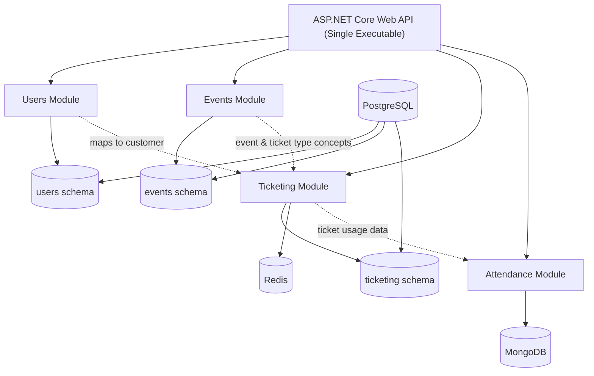

# Evently — Modular Monolith Event Management System

**Evently** is a fictional **ticketing and event management application** built as a learning project to demonstrate **Domain-Driven Design (DDD)**, **bounded contexts**, and **modular monolith architecture** using **ASP.NET Core Web API**.

The system supports managing events, selling tickets, processing payments, and tracking attendance for events such as concerts, conferences, and movie screenings.

---

## Architecture Overview

- **Architecture style**: Modular Monolith  
- **Single executable**: ASP.NET Core Web API  
- **Modules implemented as vertical slices**, later refactored toward **Clean Architecture**  
- Strong emphasis on:
  - Clear module boundaries
  - Ownership of data per module
  - Avoiding tight coupling between domains  

Although deployed as a single application, each module behaves like an isolated bounded context.

---

## High-Level System Diagram

---

## Technology Stack

- **Backend**: ASP.NET Core Web API  
- **Identity & Authentication**: Keycloak  
- **Primary Database**: PostgreSQL (schema-per-module)  
- **Caching / Fast access**: Redis (Ticketing module)  
- **Analytics / Attendance storage**: MongoDB (Attendance module)  

---

## Database Design

- A **single PostgreSQL database**
- Each module owns its **own schema**
- Modules **do not directly access** other modules’ schemas
- Cross-module communication and data sharing are handled via controlled mechanisms

---

## Core Modules

### Users Module
- Core entity: **User**
- Manages:
  - Users
  - Roles
  - Permissions
- Implements **Role-Based Access Control (RBAC)**
- Source of truth for identity
- Other modules reference users indirectly (e.g. “customers”)

---

### Events Module
- Defines **events** that users can attend and buy tickets for
- Manages:
  - Events
  - Ticket types (Early Bird, Standard, VIP)
  - Event categories
- **Not public-facing**
- Acts as an **administration module**
- Source of truth for event-related data

---

### Ticketing Module (Core Domain)
- Central module with the **most business logic**
- Handles:
  - Carts and cart items
  - Orders and order items
  - Checkout flow
  - Payments and refunds
  - Discount codes
  - Ticket generation
- Uses **Redis** for performance-sensitive operations
- Operates within its own **bounded context**
- Customers map to users from the Users module

---

### Attendance Module
- Tracks **event attendance**
- Records:
  - Attended events
  - Used tickets
- Detects anomalies (e.g. duplicate ticket usage)
- Uses **MongoDB** for flexible analytics-style data storage

---

## Key Design Principles

- Modular monolith with **clear bounded contexts**
- Vertical slice architecture per module
- Progressive refactoring toward **Clean Architecture**
- Separation of:
  - Administrative concerns
  - Customer-facing concerns
- Focused on teaching **real-world architectural trade-offs**
